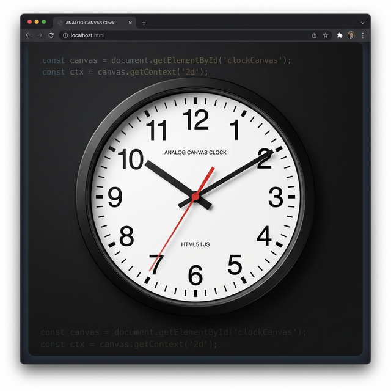

# SAK - Zegar Analogowy w HTML5 Canvas

Ten projekt to implementacja zegara analogowego przy użyciu HTML5 Canvas i JavaScript zgodnie z wymaganiami na ocenę 5.0.

## Funkcje
- Zegar pokazuje aktualny czas systemowy.
- Poprawne wykorzystanie transformacji (`ctx.save()` i `ctx.restore()`).
- Architektura zorientowana obiektowo (klasy `Clock`, `Hand`).
- Wskazówki są różnej grubości i kolorów.
- Tarcza posiada narysowane kreseczki godzinowe i minutowe.
- Możliwość zatrzymania/wznowienia animacji zegara przez wciśnięcie spacji.

## Podgląd projektu

## GitHub Pages
Projekt jest dostępny pod adresem: [https://gpsql.github.io/SAK/Lab2/](https://gpsql.github.io/SAK/Lab2/)
